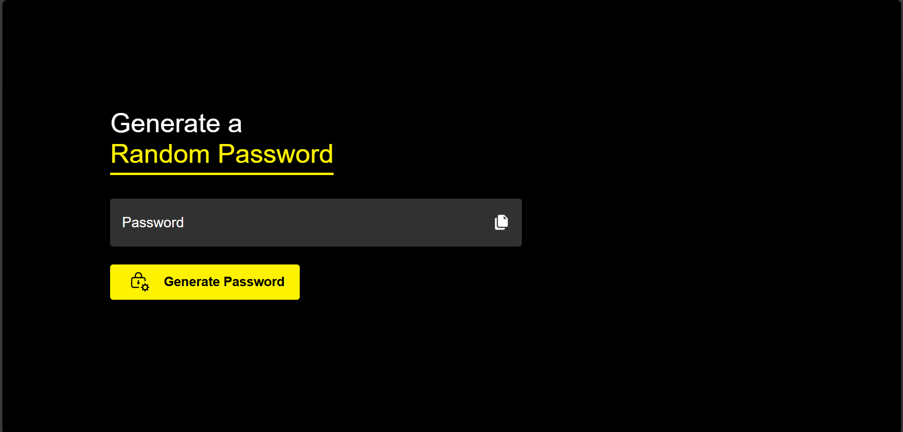

# PASSWORD‑GENERATOR

A simple, lightweight web-based password generator built with **HTML**, **CSS**, and **JavaScript**. It creates 12‑character passwords combining uppercase letters, lowercase letters, numbers, and symbols.

---

## 🚀 Live Demo

🔗 [View the Password Generator Live](https://shashank1220.github.io/PASSWORD-GENERATOR/)

---

##  Features

- Generates secure random passwords of exactly 12 characters.
- Includes uppercase letters, lowercase letters, numbers, and symbols.
- Built with vanilla HTML, CSS, and JavaScript—no external dependencies.

---

## 💻 Technologies Used

- **HTML5** – Structure
- **CSS3** – Styling and layout
- **JavaScript (ES6)** – Stopwatch logic and interactivity

---

## 📸 Screenshots

---

## Optional enhancements:

<li>Add controls to adjust password length or character set.

<li>Add a “Copy to Clipboard” button.

<li>Style updates or animations using CSS.

## License

    This project is licensed under the MIT License—feel free to use, modify, or distribute it as you like.
